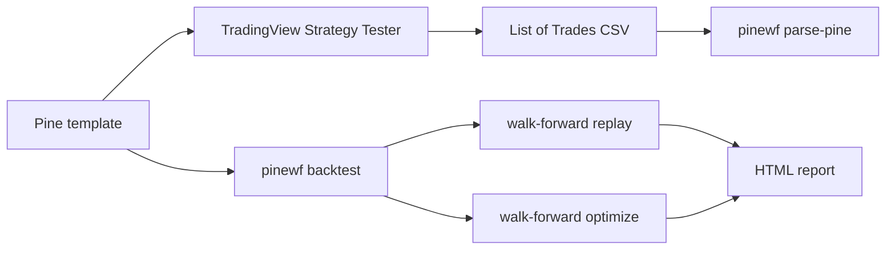

# Pine Script Strategy Template

**A Pine Script v6 strategy template that comes with walk-forward validation. Stop shipping curve-fit strategies.**

[](https://github.com/baronguyen001/pinescript-strategy-template/actions/workflows/ci.yml)
[](LICENSE)


TradingView's Strategy Tester gives you one in-sample story. That is useful, but it is also easy to overfit. This repo pairs two generic Pine v6 moving-average strategy templates with `pinewf`, a Python companion that replays fills, runs parameter grids, performs walk-forward tests, parses TradingView trade exports, and generates a self-contained HTML report.

Template, bring your own thresholds. The defaults are illustrative starting points, not a recommendation.

## 30-second Demo

```bash
pip install -e ".[viz]"
pinewf walkforward examples/sample_btc_4h.csv --train 2 --test 1 --optimize
pinewf report examples/sample_btc_4h.csv --html out.html --walkforward
```

The sample file is a small public-data-derived, normalized OHLCV fixture for offline demos only. Any numbers printed from it are illustrative research output, not strategy guidance.

## What's Included

| Piece | Why It Exists |
| --- | --- |
| `strategies/strategy_template.pine` | Full configurable Pine v6 template with trend filter, stops, optional exits, table, and alerts. |
| `strategies/strategy_minimal.pine` | Small teaching version: MA cross plus fixed percent stop. |
| `pinewf backtest` | Python fill engine using signal-at-close to next-open execution with slippage and commission. |
| `pinewf grid` | In-sample parameter grid plus an overfit warning. |
| `pinewf walkforward` | Fixed-parameter replay and train-then-test optimization. |
| `pinewf parse-pine` | Metrics from TradingView's own List of Trades CSV export. |
| `pinewf report` | Self-contained HTML report with equity curve and OOS table. |

## How It Works



## Install

```bash
pip install pinescript-walkforward
pip install "pinescript-walkforward[viz]"  # for HTML report charts
```

PyPI publish is pending for v0.1.0. Until then, use:

```bash
pip install -e ".[viz]"
```

## Common Commands

```bash
pinewf backtest examples/sample_btc_4h.csv
pinewf grid examples/sample_btc_4h.csv --grid-fast 9,20 --grid-slow 50,100 --sl 6,8,10
pinewf walkforward examples/sample_btc_4h.csv --train 2 --test 1
pinewf walkforward examples/sample_btc_4h.csv --train 2 --test 1 --optimize
pinewf parse-pine examples/sample_tradingview_export.csv
```

## TradingView Setup

Open `docs/pine_setup.md`, paste a template into Pine Editor, then export Strategy Tester trades if you want metrics on TradingView's own execution output.


## Walk-forward, Not Curve-fit

Replay mode asks whether fixed parameters survive future windows. Optimize mode chooses parameters on each train span, then scores exactly one following test span and reports degradation. Template, bring your own thresholds; the value is the validation process, not a magic config.

## Comparison

| Feature | Raw Strategy Tester | Typical Pine Repo | This Repo |
| --- | ---: | ---: | ---: |
| Parameterized Pine template | Yes | Sometimes | Yes |
| Next-open Python re-sim | No | Rare | Yes |
| Walk-forward replay | No | Rare | Yes |
| Walk-forward optimize | No | Rare | Yes |
| TradingView CSV metrics | Limited | Rare | Yes |
| HTML report | No | Rare | Yes |

## Related

- `walk-forward-validator`: advanced validation splitters for broader research.
- `Trawlkit`: turn a strategy that survives OOS review into a live scrape-to-AI-to-alert workflow.
- `ai-automation-skills`: free automation playbooks downstream from the same portfolio.

## Disclaimer

Educational tooling only. Not financial advice. Backtests do not predict future results. Bring your own data, costs, risk limits, and review process.
