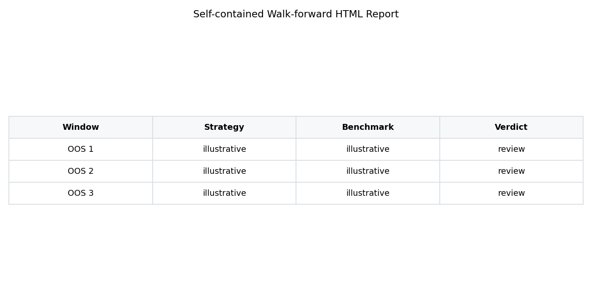
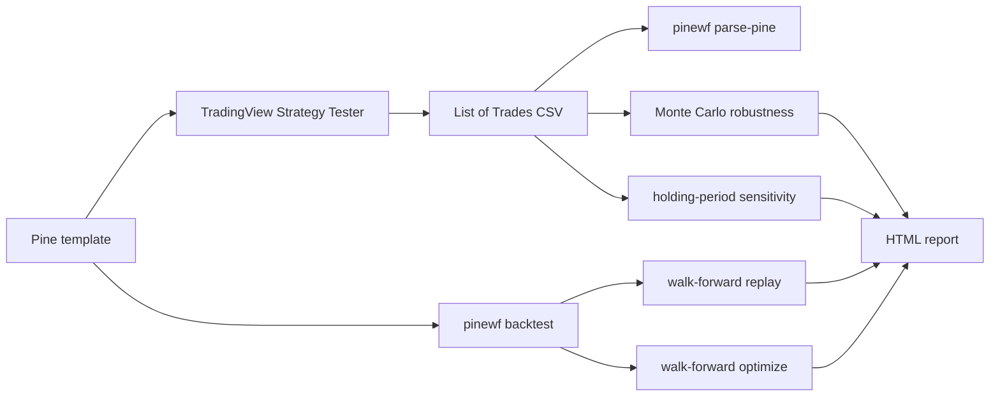
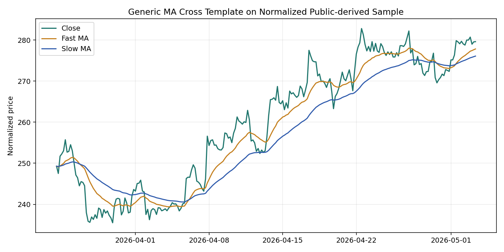

# Pine Script Strategy Template

**A Pine Script v6 strategy template that comes with walk-forward validation. Stop shipping curve-fit strategies.**

[](https://github.com/baronguyen001/pinescript-strategy-template/actions/workflows/ci.yml)
[](LICENSE)



TradingView's Strategy Tester gives you one in-sample story. That is useful, but it is also easy to overfit. This repo pairs generic Pine v6 trend, mean-reversion, and short-side breakdown templates with `pinewf`, a Python companion that replays fills, runs parameter grids, performs walk-forward tests, stress-tests realized trades with Monte Carlo, checks holding-period sensitivity, parses TradingView trade exports, and generates a self-contained HTML report.

Template, bring your own thresholds. The defaults are illustrative starting points, not a recommendation.

## 30-second Demo

```bash
pip install -e ".[viz]"
pinewf walkforward examples/sample_btc_4h.csv --train 2 --test 1 --optimize
pinewf montecarlo examples/sample_tradingview_export.csv --iters 1000 --seed 7
pinewf report examples/sample_btc_4h.csv --html out.html --walkforward
```

The sample file is a small public-data-derived, normalized OHLCV fixture for offline demos only. Any numbers printed from it are illustrative research output, not strategy guidance.

## What's Included

| Piece | Why It Exists |
| --- | --- |
| `strategies/strategy_template.pine` | Full configurable Pine v6 template with trend filter, stops, optional exits, table, and alerts. |
| `strategies/strategy_minimal.pine` | Small teaching version: MA cross plus fixed percent stop. |
| `strategies/strategy_meanrev.pine` | Generic RSI/Bollinger mean-reversion template with risk exits and alerts. |
| `strategies/strategy_short.pine` | Generic short-only breakdown template with mirrored risk exits and alerts. |
| `strategies/strategy_breakout.pine` | Generic long-only Donchian-channel breakout template with a channel exit and alerts. |
| `pinewf backtest` | Python fill engine using signal-at-close to next-open execution with slippage and commission (`--risk` adds Sortino/Calmar/Ulcer/drawdown-duration). |
| `pinewf grid` | In-sample parameter grid plus an overfit warning. |
| `pinewf walkforward` | Fixed-parameter replay and train-then-test optimization. |
| `pinewf montecarlo` | Trade-order shuffle and bootstrap bands, with optional `--png` equity-band chart. |
| `pinewf sensitivity` | Holding-period buckets that flag edge overfit to one trade-duration band. |
| `pinewf parse-pine` | Metrics from TradingView's own List of Trades CSV export. |
| `pinewf report` | Self-contained HTML report with equity curve, OOS tables, degradation chart, sensitivity, and optional MC bands. |

## How It Works



## Install

```bash
pip install pinescript-walkforward
pip install "pinescript-walkforward[viz]"  # for HTML report charts
```

PyPI publish is pending for v0.1.0. Until then, use:

```bash
pip install -e ".[viz]"
```

## Common Commands

```bash
pinewf backtest examples/sample_btc_4h.csv
pinewf grid examples/sample_btc_4h.csv --grid-fast 9,20 --grid-slow 50,100 --sl 6,8,10
pinewf walkforward examples/sample_btc_4h.csv --train 2 --test 1
pinewf walkforward examples/sample_btc_4h.csv --train 2 --test 1 --optimize
pinewf walkforward examples/sample_btc_4h.csv --train 2 --test 1 --optimize --html out.html
pinewf parse-pine examples/sample_tradingview_export.csv
pinewf montecarlo examples/sample_tradingview_export.csv --iters 1000 --seed 7
pinewf montecarlo examples/sample_tradingview_export.csv --iters 1000 --seed 7 --png mc.png
pinewf sensitivity examples/sample_tradingview_export.csv
```

## TradingView Setup

Open `docs/pine_setup.md` or `docs/mean_reversion_template.md`, paste a template into Pine Editor, then export Strategy Tester trades if you want metrics on TradingView's own execution output.



## Walk-forward, Not Curve-fit

Replay mode asks whether fixed parameters survive future windows. Optimize mode chooses parameters on each train span, then scores exactly one following test span and reports degradation. The HTML report now includes per-window parameters and a train-vs-out-of-sample degradation chart. Template, bring your own thresholds; the value is the validation process, not a magic config.

## Monte Carlo Robustness

`pinewf montecarlo` answers a different question from walk-forward: are the realized trades stable, or does the equity curve depend on lucky ordering?

```bash
pinewf montecarlo examples/sample_tradingview_export.csv --iters 1000 --seed 7
pinewf report examples/sample_btc_4h.csv --html out.html --walkforward --montecarlo-trades examples/sample_tradingview_export.csv
```

It runs two offline simulations over user-supplied trade returns:

- `shuffle`: same returns, different order, useful for sequence-risk drawdown checks.
- `bootstrap`: resampled returns, useful for percentile bands around final equity, max drawdown, and Sharpe.

Add `--png out.png` to export the equity percentile-band chart for a launch post or a README (needs the `[viz]` extra). The same chart is embedded in the HTML report whenever Monte Carlo bands are included.

```bash
pinewf montecarlo examples/sample_tradingview_export.csv --iters 1000 --seed 7 --png mc.png
```

## Holding-period Sensitivity

`pinewf sensitivity` answers yet another question: is the edge spread across trade durations, or does it all come from one holding band?

```bash
pinewf sensitivity examples/sample_tradingview_export.csv
pinewf report examples/sample_btc_4h.csv --html out.html --walkforward --sensitivity-trades examples/sample_tradingview_export.csv
```

It buckets realized trades by holding duration (preferring the engine's `bars_held`, falling back to calendar days from a TradingView export), reports per-bucket win rate, average P&L, profit factor, and each bucket's share of gross profit, then flags `CONCENTRATED` when a single band holds most of the profit. Use it to catch an edge that is overfit to one duration. Bucket edges and the concentration threshold are configurable with `--buckets` and `--concentration`.

## Comparison

| Feature | Raw Strategy Tester | Typical Pine Repo | This Repo |
| --- | ---: | ---: | ---: |
| Parameterized Pine template | Yes | Sometimes | Yes |
| Next-open Python re-sim | No | Rare | Yes |
| Walk-forward replay | No | Rare | Yes |
| Walk-forward optimize | No | Rare | Yes |
| Monte Carlo trade robustness | No | Rare | Yes |
| Holding-period sensitivity | No | Rare | Yes |
| Short-side template | Sometimes | Sometimes | Yes |
| TradingView CSV metrics | Limited | Rare | Yes |
| Rich HTML report | No | Rare | Yes |

## Related

- `walk-forward-validator`: advanced validation splitters for broader research.
- `Trawlkit`: when a strategy survives OOS review, → **build the full bot with Trawlkit** as a live scrape-to-AI-to-alert workflow.
- `ai-automation-skills`: free automation playbooks downstream from the same portfolio.

## Disclaimer

Educational tooling only. Not financial advice. Backtests do not predict future results. Bring your own data, costs, risk limits, and review process.
